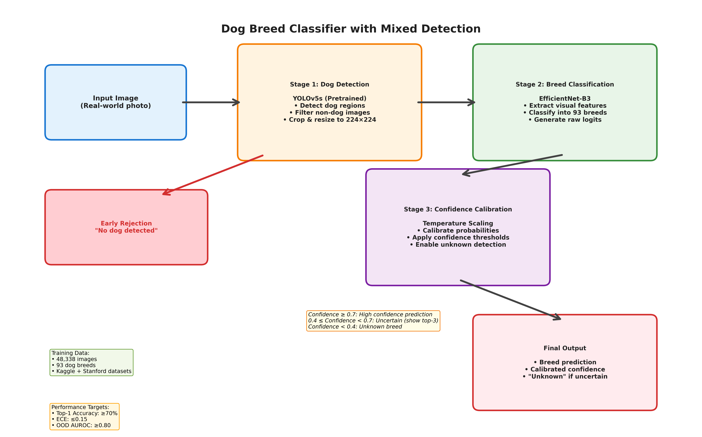

# Dog Breed Classifier with Mixed Detection

A robust deep learning system for dog breed classification that handles real-world photo conditions, detects out-of-distribution inputs, and provides calibrated confidence scores with unknown detection capabilities.



## 🎯 Project Overview

Standard dog breed classifiers fail in real-world scenarios with messy phone photos (weird angles, partial dogs, low light, cluttered backgrounds) and often hallucinate breed predictions for non-dog images. This project develops a robust dog breed identification system that:

- **Handles real-world conditions**: Blur, poor lighting, partial views, multiple dogs
- **Rejects uncertain predictions**: "Unknown" classification instead of confident wrong answers
- **Provides calibrated confidence**: Temperature-scaled probabilities for reliable uncertainty estimates
- **Multi-source training**: Combines Kaggle and Stanford datasets for improved robustness

## 🏗️ Architecture

### Multi-Stage Pipeline Design

1. **Stage 1 - Dog Detection**: YOLOv5s detects and localizes dogs, rejecting non-dog images
2. **Stage 2 - Breed Classification**: EfficientNet-B3 classifies into 93 breeds
3. **Stage 3 - Confidence Calibration**: Temperature scaling for reliable uncertainty quantification

### Key Features

- **Early rejection**: Non-dog images filtered out at detection stage
- **Robust classification**: EfficientNet-B3 with transfer learning and progressive fine-tuning
- **Unknown detection**: Threshold-based rejection using calibrated probabilities
- **Interpretability**: Grad-CAM visualizations for model attention analysis

## 📊 Dataset

### Combined Multi-Source Dataset
- **Total Images**: 48,338
- **Breeds**: 93 dog breeds
- **Training**: 45,040 images (252% increase from single source)
- **Validation**: 1,524 images
- **Test**: 1,774 images

### Data Sources
1. **Kaggle Dog Breed Classification**: 16,080 images with real-world variability
2. **Stanford Dogs Dataset**: 41,160 images with high-quality, controlled conditions

### Robustness Test Sets
- Gaussian blur (motion blur simulation)
- Low lighting conditions
- Partial/cropped dogs
- Multiple dogs in frame
- Out-of-distribution samples (cats, wolves, objects)

## 🚀 Quick Start

### Prerequisites
```bash
pip install -r requirements.txt
```

### Dataset Setup
```bash
# Analyze and combine datasets
python scripts/combine_datasets.py

# Quick setup for dataset preparation
python scripts/quick_setup.py

# Analyze existing dataset structure
python scripts/analyze_dataset.py
```

### Training
```bash
# Note: Training scripts are in development
# Current available training modules in src/training/

# Basic training (to be implemented)
python -m src.training.train --config configs/config.yaml
```

### Inference
```bash
# Single image prediction
python scripts/predict.py --image path/to/dog.jpg --model checkpoints/best_model.pth
```

## 📁 Project Structure

```
├── src/
│   ├── data/
│   │   ├── dataset.py              # PyTorch Dataset classes
│   │   ├── augmentation.py         # Data augmentation pipeline
│   │   ├── Kaggle_dataset/         # Kaggle dog breed data
│   │   └── Stanford_dataset/       # Stanford dogs data
│   ├── models/
│   │   ├── detector.py             # YOLOv5 dog detection
│   │   ├── classifier.py           # EfficientNet-B3 classifier
│   │   └── calibration.py          # Temperature scaling
│   ├── training/
│   │   ├── train.py                # Training loop
│   │   ├── evaluate.py             # Evaluation functions
│   │   └── utils.py                # Training utilities
│   └── visualization/
│       ├── gradcam.py              # Grad-CAM implementation
│       └── plots.py                # Visualization utilities
├── scripts/
│   ├── analyze_dataset.py          # Dataset analysis and statistics
│   ├── combine_datasets.py         # Combine Kaggle + Stanford datasets
│   ├── predict.py                  # Single image inference
│   ├── prepare_data.py             # Data preparation utilities
│   └── quick_setup.py              # Quick dataset setup
├── configs/
│   └── config.yaml                 # Hyperparameters
├── data/processed/                 # Processed annotations
├── checkpoints/                    # Saved models
└── README.md
```

## 🎯 Performance Targets

| Metric | Target | Description |
|--------|--------|-------------|
| Top-1 Accuracy | ≥ 70% | Correct breed prediction |
| Top-5 Accuracy | ≥ 85% | Correct breed in top-5 |
| ECE | ≤ 0.15 | Expected Calibration Error |
| OOD AUROC | ≥ 0.80 | Out-of-distribution detection |
| Robustness Accuracy | ≥ 60% | Performance on corrupted images |
| Inference Time | ≤ 5s | Per image processing time |
| Model Size | ≤ 500MB | Deployment constraint |

## 🔧 Configuration

Edit `configs/config.yaml` to modify:

```yaml
model:
  architecture: efficientnet_b3
  num_classes: 93
  dropout: [0.3, 0.2]

training:
  batch_size: 32
  learning_rate: 0.001
  weight_decay: 0.01
  label_smoothing: 0.1

detection:
  model: yolov5s
  confidence_threshold: 0.5

thresholds:
  high_confidence: 0.7
  medium_confidence: 0.4
  low_confidence: 0.4
```

## 📈 Evaluation

### Standard Evaluation
```bash
# Note: Evaluation scripts are in development
# Current evaluation modules available in src/training/evaluate.py

# Basic evaluation (to be implemented as standalone script)
python -m src.training.evaluate --model checkpoints/best_model.pth
```

### Robustness Testing
```bash
# Robustness evaluation (to be implemented)
# Current: Use src/training/evaluate.py functions
```

### Out-of-Distribution Detection
```bash
# OOD evaluation (to be implemented)
# Current: Use src/training/evaluate.py functions
```

## 🎨 Visualization

### Generate Grad-CAM Visualizations
```python
from src.visualization.gradcam import GradCAM, visualize_gradcam_grid

# Create Grad-CAM visualizations
gradcam = GradCAM(model, target_layer='features')
visualization = gradcam.visualize(input_image, original_image)
```

### Training Curves
```python
from src.visualization.plots import plot_training_history

# Plot training history
plot_training_history(history, save_path='training_curves.png')
```

## 🔬 Research Contributions

### Novel Aspects
1. **Multi-stage robustness pipeline** for real-world deployment
2. **Dual-source dataset integration** for improved generalization
3. **Calibrated unknown detection** for reliable uncertainty quantification
4. **Comprehensive robustness evaluation** across multiple corruption types

### Academic Alignment (APS360)
- ✅ **Multi-source data integration**: Kaggle + Stanford datasets
- ✅ **Significant engineering contribution**: Beyond tutorial-level complexity
- ✅ **Robustness evaluation**: Real-world performance assessment
- ✅ **Uncertainty quantification**: Calibrated confidence scores

## 🤝 Ethics & Limitations

### Ethical Considerations
- **Breed-specific legislation**: Potential misuse for discriminatory policies
- **Dataset bias**: Geographic and demographic representation issues
- **Mixed breed limitations**: Trained on purebreds, may bias against mixed breeds

### Mitigation Strategies
- Clear documentation of model limitations
- Confidence scores with all predictions
- Recommendation for human oversight in high-stakes decisions
- Decision-support tool rather than autonomous classifier

## 📚 References

1. Khosla et al. - Stanford Dogs Dataset (2011)
2. Hendrycks & Dietterich - Neural Network Robustness (2019)
3. Guo et al. - Neural Network Calibration (2017)
4. Tan & Le - EfficientNet (2019)
5. Jocher et al. - YOLOv5 (2020)

## 📄 License

This project is for academic use only (APS360 course project).

## 🙏 Acknowledgments

- Stanford Dogs Dataset
- Kaggle Dog Breed Classification Dataset
- PyTorch and timm libraries
- YOLOv5 by Ultralytics

---

**Status**: ✅ Dataset preparation complete, training infrastructure ready for implementation